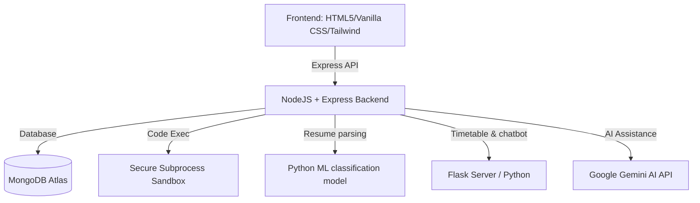

# 🧠 SYNAPSE — Premium Student Placement Ecosystem

> **Debug your degree, ace your placements.** An AI-powered all-in-one ecosystem for college studying, DSA preparation, mock interviews, and career tracking.

---

## 🏆 Hackathon Submission Details
- **Project Name:** SYNAPSE
- **Tagline:** The ultimate developer co-pilot for college students seeking top placements.
- **Key Focus Areas:** Machine Learning, AI Integration (Gemini), Gamification, Live Coding Sandbox, ATS Scoring.

---

## 🚀 Key Features

### 🔴 Core Components
1. **🤖 Machine Learning Resume Analyzer**
   - Upload PDF resumes to match against candidate roles.
   - Computes real-time **ATS Similarity Score** with list of matching/missing tags.
   - Recommends customized study roadmaps based on missing skills.
   
2. **💻 live Code Sandbox Compiler**
   - Support for Java, Python, and C++.
   - Executes user-submitted code securely inside sandboxed timeouts.
   - Built-in **AI Complexity Analyzer** (computes O-notation space/time dynamically).
   
3. **💬 AI-Powered Mock Interviews & Study Forge**
   - Simulated technical phone screen and behavior rounds.
   - Powered by **Google Gemini API** to generate real-time feedback.
   - Day-by-day custom **Study Plan Generator** that maps tasks against user constraints (target date, daily hours, current level).

### 📈 Gamification & Engagement
4. **📊 Performance Analytics Dashboard**
   - High-fidelity visualization powered by **Chart.js**.
   - Track DSA streaks, ATS progression history, and study focus times.
   - **Contribution Graph:** GitHub-style calendar visualizing active days.
   - **XP & Levels:** Experience points earned via solving problems (+10 XP), scan resume (+15 XP), mock interview (+25 XP).
   - **Badges System:** Earn badges like *First Scan*, *Elite Student*, *Week Warrior*, *Synapse Master*.

5. **📱 Progressive Web App (PWA)**
   - Offline page load support with `sw.js` caching.
   - Fully installable on iOS and Android with custom launcher icons.

---

## 🛠️ Architecture & Tech Stack



* **Frontend:** HTML5, Tailwind CSS, Vanilla JS, Chart.js, Monaco Code Editor, Confetti.js.
* **Backend:** Node.js, Express.js, Flask (Python).
* **Database:** MongoDB Atlas, Local Storage.
* **AI & Machine Learning:** Google Gemini Pro API, Scikit-learn (Resume Classification), PyPDF2.
* **DevOps:** Render (Deployment), PWA (Service Workers).

---

## 📦 Installation & Setup

### Prerequisites
* [Node.js](https://nodejs.org/) (v16+)
* [Python 3](https://www.python.org/) (v3.8+)

### Step-by-Step Local Deployment

1. **Clone the repository:**
   ```bash
   git clone https://github.com/pratham2978/Simply-Updify-InnovateX-Hackathon.git
   cd Simply-Updify-InnovateX-Hackathon
   ```

2. **Setup Backend Environment:**
   Create a `.env` file inside the `backend` directory:
   ```env
   PORT=5000
   MONGODB_URI=mongodb+srv://<username>:<password>@cluster0.example.mongodb.net/synapse
   JWT_SECRET=super_secret_auth_key_for_synapse
   GEMINI_API_KEY=AIzaSyYourGeminiApiKeyHere
   ```

3. **Install Dependencies & Launch Backend:**
   ```bash
   # Install NodeJS packages
   cd backend
   npm install
   
   # Start the Node + Express Server
   npm start
   ```

4. **Launch Frontend:**
   The frontend is static and located in the `f/` directory. When the backend runs, it serves the static files automatically. Navigate to `http://localhost:5000` to interact with the platform.

---

## 🌟 Demo Mode

Want to test all features instantly without creating an account?
1. Open the homepage.
2. Click **Try Demo Mode** or **Demo Mode** in the navbar.
3. The platform will automatically populate mock resume history, DSA stats, badges, and streaks!

---

## 🏆 Development Team
* **Pratham Mishra** — Lead Developer & Architect
